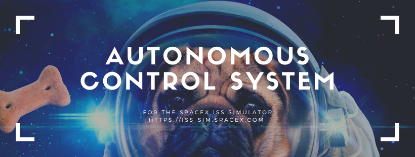

# SpaceX ISS Simulator Autopilot
Successfully dock dragon capsule autonomously with a 6DoF PID control architecture. Written in JS for ease of controlling simulator. 

Uses 6 separate PDs controllers for each DoF--  yaw, pitch roll, x, y, and z. Symmetric limiters and gating logic is used too.

# Watch It In Action
